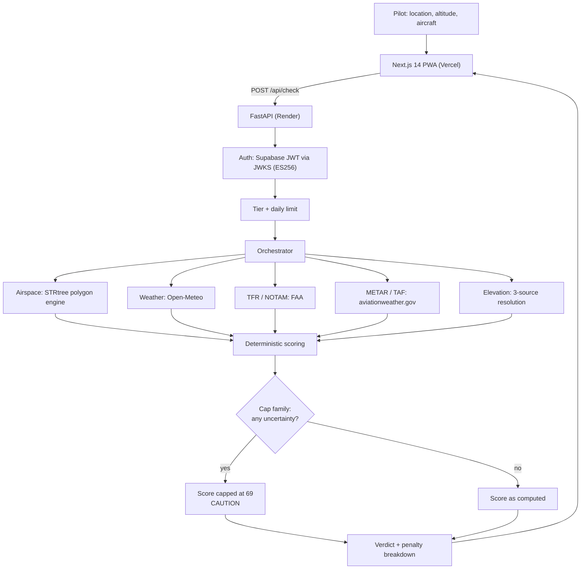

<p align="center">
  
</p>

<h1 align="center">UAS SkyCheck</h1>

<p align="center">
  <strong>Architecture and design decisions behind a production drone preflight tool</strong>
</p>

<p align="center">
  <a href="https://uas-skycheck.app">
    
  </a>
  &nbsp;
  
  &nbsp;
  
  &nbsp;
  
</p>

<p align="center">
  <a href="https://uas-skycheck.app"><strong>Try It Free</strong></a>
  &nbsp;&nbsp;|&nbsp;&nbsp;
  <a href="#the-invariant-that-shapes-everything"><strong>The Invariant</strong></a>
  &nbsp;&nbsp;|&nbsp;&nbsp;
  <a href="#the-cap-family"><strong>The Cap Family</strong></a>
  &nbsp;&nbsp;|&nbsp;&nbsp;
  <a href="#system-shape"><strong>System Shape</strong></a>
  &nbsp;&nbsp;|&nbsp;&nbsp;
  <a href="#design-decisions-worth-explaining"><strong>Design Decisions</strong></a>
</p>

---

**This repository is documentation only.** The source code and datasets are private and proprietary. Nothing here grants any right to the software it describes. What it does is explain how the system is built, and, more usefully, *why* it is built that way.

*Last reviewed: July 2026.*

## Contents

- [The problem](#the-problem)
- [The invariant that shapes everything](#the-invariant-that-shapes-everything)
- [At a glance](#at-a-glance)
- [System shape](#system-shape)
- [The verdict pipeline](#the-verdict-pipeline)
- [The cap family](#the-cap-family)
  - [What a cap looks like to a pilot](#what-a-cap-looks-like-to-a-pilot)
- [Data and provenance](#data-and-provenance)
- [The polygon engine and the fail-loud gate](#the-polygon-engine-and-the-fail-loud-gate)
- [Design decisions worth explaining](#design-decisions-worth-explaining)
  - [0 ft is a real elevation](#0-ft-is-a-real-elevation)
  - [Never default to green](#never-default-to-green)
  - [Conservative drift is acceptable; optimistic drift is not](#conservative-drift-is-acceptable-optimistic-drift-is-not)
  - [Aircraft-aware verdicts](#aircraft-aware-verdicts)
- [Verification posture](#verification-posture)
- [Regulatory grounding](#regulatory-grounding)
- [What is deliberately not in this repository](#what-is-deliberately-not-in-this-repository)
- [License](#license)

---

## The problem

A drone pilot is standing in a field. Wind is picking up. They have a client waiting, a battery at 100 percent, and a decision to make: is it legal and safe to fly here, right now?

Answering that properly means reconciling controlled airspace and LAANC grid ceilings, temporary flight restrictions, national security zones, wildlife refuges, weather, density altitude, civil twilight, and their own aircraft's limits. The FAA publishes all of it. None of it is in one place, and none of it is in a form you can read on a phone with cold hands in four minutes.

UAS SkyCheck answers that question in one screen. The engineering problem is not aggregation. It is **being trustworthy about the answer**.

---

## The invariant that shapes everything

> **A false all-clear must be structurally impossible.**

Every other design decision in this system is downstream of that sentence.

A preflight tool has two failure modes, and they are not symmetric. Telling a pilot to double-check when conditions were fine costs them a phone call. Telling a pilot they are clear when they are not can put an aircraft into a helicopter's approach path. The first failure is an annoyance. The second is the only one that matters.

So the system is designed to fail toward "check again / authorization required," never toward "you're good." Concretely, this means:

- **Uncertainty is never scored as safety.** When an input is missing or unreliable, the score is capped into the caution band rather than computed as though the input were benign. See [the cap family](#the-cap-family).
- **No sentinel value may be indistinguishable from a real reading.** If a lookup fails, it returns `None`, never a plausible number. See [0 ft is a real elevation](#0-ft-is-a-real-elevation).
- **Ambiguity defaults to yellow.** Every place the UI derives a color, an unrecognized or missing status renders as caution. Green requires an affirmative green from the backend.
- **The service refuses to start rather than serve a verdict it cannot compute.** See [the polygon engine](#the-polygon-engine-and-the-fail-loud-gate).

That last one is worth pausing on. Most services are built to degrade gracefully. This one is built to degrade *loudly*, because a silently degraded preflight verdict is worse than no preflight tool at all: the pilot has already outsourced the judgment.

---

## At a glance

| | |
|---|---|
| **Product** | FAA Part 107 and recreational drone preflight intelligence, [uas-skycheck.app](https://uas-skycheck.app) |
| **Frontend** | Next.js 14 PWA on Vercel, offline-capable, installable |
| **Backend** | FastAPI on Render, JSON API, no server-rendered HTML |
| **Auth** | Supabase, asymmetric ES256 JWTs verified against JWKS |
| **Data** | 14,000+ airports, 11,000+ restricted zones across 22 categories |
| **Geometry** | Shapely with an STRtree index over 9,000+ polygon-backed zones |
| **Scoring** | Deterministic and pure, no I/O, fully reproducible from its inputs |
| **Tests** | 2,000+ automated, including invariant regressions |
| **Built by** | One engineer |

---

## System shape



**Stack:** Next.js 14 PWA on Vercel. FastAPI on Render. Supabase for auth and persistence (asymmetric ES256 JWTs verified against JWKS). Stripe for billing. Resend for transactional mail. Open-Meteo (commercial tier) for weather. FAA and NOAA sources for airspace, TFRs, and aviation weather.

**Client-side rendering discipline:** the map loads Leaflet via a dynamic `import()` inside an effect, never through a React wrapper that touches `window` at module evaluation. Map initialization is deferred behind `requestIdleCallback` so that the pilot reads the score before any main-thread work for the map begins. The verdict is the product; the map is decoration.

---

## The verdict pipeline

The orchestrator resolves every input, then hands a single flat dictionary to a pure scoring function. Scoring performs no I/O. This matters more than it sounds: it means the verdict is a deterministic function of its inputs, so it can be tested exhaustively, reproduced from a log line, and explained to a pilot without hand-waving.

The result carries not just a score but the **penalty breakdown that produced it**: every deduction, its size, and its reason, in the pilot's language. If the tool says 62, the pilot can see the 62.

### Score bands

| Band | Range | Meaning |
|---|---|---|
| EXCELLENT | 85 to 100 | Favorable |
| GOOD | 70 to 84 | Acceptable |
| CAUTION | 50 to 69 | Verify before flying |
| POOR | below 50 | Do not fly |

The boundary at 70 is the one that carries weight, because it is the line between "go" and "look again."

---

## The cap family

Four conditions hard-cap the score at **69**: the top of CAUTION, one point below GOOD. This is the mechanism that makes a false all-clear structurally impossible rather than merely unlikely.

| Cap | Fires when | Why it is not optional |
|---|---|---|
| Simulated weather | The weather API failed and values are synthesized | A plausible-looking forecast that is actually a guess must never read as GOOD |
| Class B proximity | Distance ratio to Class B airspace is within a safety margin | Grid boundaries are approximations; the edge case belongs to the aircraft, not the algorithm |
| Stale TFR data | Live TFR fetch failed and static fallback data is in use | An absent TFR and an unfetched TFR look identical, and only one is safe |
| Unknown elevation | All three elevation sources failed | Elevation feeds density altitude, and missing DA suppresses a hazard warning |

The rule that governs this family: **any new source of uncertainty must join it, or be argued out of it explicitly.** Uncertainty is never allowed to score silently.

### What a cap looks like to a pilot

An illustrative verdict where conditions are largely favorable but one input could not be resolved:

```text
Score      69 / 100   CAUTION          <- capped, not computed
Aircraft   Mini / Nano (under 250 g)
Altitude   400 ft AGL

Penalties
   -7   Moderate winds: 16 mph
   -2   Suburban/populated area: moderate ground risk

Safety cap
  -22   Terrain elevation unavailable: density altitude not computed;
        verify field elevation and expect reduced performance if high
```

Without the cap this reads 91, comfortably GOOD, and the pilot would never learn that a density altitude figure was missing rather than favorable. The cap is not a fudge factor. It is the system saying, in the breakdown and in the pilot's own language, *I could not verify this, so I will not certify it.*

Note also what the breakdown does **not** do: it does not hide the cap inside the total. The deduction is itemized with its reason, so the pilot can see exactly which piece of the answer is missing and go resolve it themselves.

The number 69 is not arbitrary. A capped score is not a punishment, it is a statement: *this system cannot currently certify this flight as good.* Placing the cap one point below GOOD means no capped condition can ever render green, no matter how favorable every other input is.

---

## Data and provenance

- **14,000+ airports** with class, tower status, LAANC availability, and proximity radii
- **11,000+ restricted zones** across 22 categories: national parks, wildlife refuges, military installations, national security zones, stadiums, hospitals, prisons, and more
- **9,000+ of those zones are polygon-backed**, not circles

That last figure is the important one, and it drove a significant piece of engineering. A circle is a lie about a wildlife refuge. Arctic National Wildlife Refuge has a stored proximity radius of 80 NM and a true extent over 400 NM. For the majority of polygon-backed zones, the stored radius understates the real footprint. Containment testing by radius would therefore return "outside the zone" for points that are demonstrably inside it: a false all-clear, produced by a rounding convenience.

Counts shown in the product are presented as soft figures ("14,000+") because they change as the datasets are refreshed, while a single exact, dated provenance figure sits next to the verdict. Precision that is going to drift should not be dressed up as precision.

---

## The polygon engine and the fail-loud gate

Zone containment uses Shapely with an STRtree spatial index built once at startup, reducing per-query containment from a linear scan to logarithmic lookup.

The interesting part is what happens when it cannot build.

The original code caught the failure, logged a warning, and continued, falling back to radius-based containment. That is the textbook graceful-degradation pattern, and here it was exactly wrong: the service would keep serving verdicts, from a containment test known to under-cover most zones, with nothing in the response indicating anything had changed. A pilot would receive a confident green with no way to know the engine behind it had quietly been replaced with a worse one.

It now **refuses to start**:

```text
RuntimeError: Polygon engine unavailable: N polygon-backed zones loaded but the
spatial index did not build (shapely missing or geometry malformed). Refusing to
start to avoid false all-clears.
```

A crash-looping deploy is a bad afternoon. A silently degraded preflight verdict is a bad outcome. The gate converts the second into the first, on purpose.

---

## Design decisions worth explaining

### 0 ft is a real elevation

Terrain elevation feeds density altitude, and it is *high* density altitude that draws a scoring penalty and a pilot warning. The elevation lookup returned `0` on any failure, documented as a "safe-side underestimate."

That reasoning is inverted, and the inversion is instructive. Sea-level DA is indeed lower than true DA at altitude, so the statement is true. But **underestimating a hazard metric is optimistic, not conservative.** A dropped lookup at a 7,000 ft site computed density altitude as though the pilot were at sea level: no penalty, and, because the DA advisory is gated above a threshold, no warning at all. A pilot in Leadville, Colorado (10,150 ft) read identically to a pilot in Miami.

The deeper defect: **0 ft is a legitimate elevation.** Miami is 0 ft. Using 0 as the error value made "sea level" and "lookup failed" indistinguishable to every downstream consumer, which is precisely why nothing could flag it. The error value was camouflaged as data.

The fix has three parts, in order of importance:

1. The lookup returns `None`, never `0`. Unknown is now a distinct state.
2. Elevation resolves from three sources: GPS override, the elevation API, then the DEM elevation the weather forecast payload already carries (free, no extra call). Most failures are absorbed before they matter.
3. If all three fail, density altitude is **not fabricated**, and the score caps at 69.

The general lesson, and the reason this section exists: **an error value that is indistinguishable from a valid reading is not a fallback, it is a silent corruption.** Pick sentinels that cannot occur naturally, or use a type that can express absence.

### Never default to green

The UI derived card styling from a status string. When the string matched no known keyword and the color was not red, it fell through to `return "clear"`, which is green. Elsewhere, a missing status color defaulted to `"green"` for the check-history dots.

Neither was reachable with well-formed backend data. Both were fixed anyway. Green must be affirmatively earned from an explicit backend green; every other path resolves to caution. Code that can only be correct while its inputs are well-formed is code that is waiting for its inputs to stop being well-formed.

### Conservative drift is acceptable; optimistic drift is not

The weather summary chip reimplements the backend's thresholds client-side, which is a duplication and therefore a drift risk. It was kept, because the client-side version is deliberately *more* conservative than the backend on ceiling, precipitation, temperature, and fog. If the two ever diverge, the chip errs toward caution.

This is the asymmetry from the top invariant applied to code architecture: duplication that can only drift in the safe direction is a tolerable cost. Duplication that could drift optimistic is not, which is why the aircraft-aware wind thresholds are **sent from the backend** rather than mirrored in the frontend. Same table, one source, no drift possible.

### Aircraft-aware verdicts

Wind tolerance is calibrated by aircraft weight class, so the same 18 mph reads as caution for a sub-250 g Mini and acceptable for a professional airframe. This was true in the scoring engine long before it was visible to pilots, which meant the verdict looked arbitrary: the tool said "high winds" and the pilot had no idea why.

The comparison is now surfaced directly, with one deliberate piece of friction: a note that a heavier aircraft reading OK does **not** make the location clear to fly. A comparison view invites exactly the wrong inference ("I'd be fine on my other drone"), and wind is one input among many. Features that make a system more transparent can also make it easier to misread. Both need designing.

---

## Verification posture

- **2,000+ automated tests** across scoring, airspace geometry, weather parsing, orchestration, regulatory citations, and API surface.
- **Scoring is pure**, so verdicts are tested as data in, data out, with no mocking of the thing under test.
- **Regression tests encode invariants, not just behavior.** There are tests asserting that an unknown elevation cannot produce a GOOD score, and that the published wind thresholds equal the ones scoring uses. Those tests exist to fail if someone later "optimizes" the safety property away.
- **Tests are audited too.** One test claimed to prove that failed elevation lookups were cached. It passed, but it could not actually detect what it claimed: with failure returning `0`, "cached 0" and "failed again, got 0 again" are the same observation. The defect had corrupted its own test. When a sentinel is ambiguous, the ambiguity propagates into the test suite, and green checkmarks start meaning less than they appear to.

---

## Regulatory grounding

Regulatory accuracy is not a feature of this product, it *is* the product. Advisories cite the controlling regulation (14 CFR 107.51 for operating limitations, 107.29 for civil twilight, 107.3 for small UAS definitions, 49 U.S.C. 44809 for recreational operations) so a pilot can verify the claim rather than trust the tool.

UAS SkyCheck is a preflight planning aid. It is not an official source of airspace authorization and does not replace the pilot in command's regulatory responsibility. A tool that positions itself as the final authority is making a promise it has no standing to keep.

---

## What is deliberately not in this repository

The source code, the curated zone datasets, infrastructure configuration, and operational specifics. This repository explains architecture and reasoning.

Worth noting for anyone evaluating the moat: the airspace facts themselves are not the defensible asset. Coordinates and boundaries are facts, largely derived from public federal sources, and facts are not copyrightable in the United States. What is defensible is the curation, the freshness, the correctness discipline described above, and the execution. That is also why publishing this document costs nothing: the reasoning is the credential, not the secret.

---

## License

Documentation in this repository: [CC BY-NC-ND 4.0](LICENSE.md). Read it, link to it, share it with attribution. Do not sell it or publish derivative versions.

The UAS SkyCheck software and datasets are proprietary, all rights reserved, and are not licensed by this repository.

Copyright (c) 2026 Ayush Jha / SudoKodes LLC.

Built by [Ayush Jha](https://github.com/jha-ayush). Questions: admin@sudokode.co
