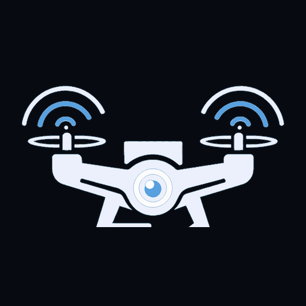
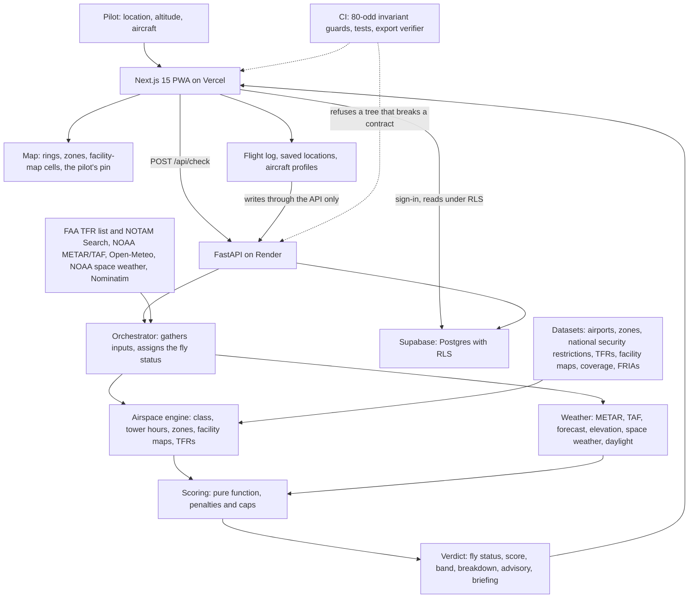

<!-- README.md (jha-ayush/uas-skycheck-architecture) -->
<p align="center">
  
</p>

<h1 align="center">UAS SkyCheck</h1>

<p align="center"><strong>Architecture and design decisions behind a production drone preflight tool</strong></p>

<p align="center">
  <a href="https://uas-skycheck.app"></a>
  
  
  
</p>

<p align="center">
  <a href="https://uas-skycheck.app">Try it free</a> ·
  <a href="#the-invariant-that-shapes-everything">The invariant</a> ·
  <a href="#the-cap-family">The cap family</a> ·
  <a href="#system-shape">System shape</a> ·
  <a href="#the-contracts-between-layers">The contracts</a> ·
  <a href="#design-decisions-worth-explaining">Design decisions</a>
</p>

This repository contains documentation only. The source code and the datasets are private. What is here is how the system is built and, more to the point, why it is built that way: the failure modes it was designed against, the decisions that followed from them, and the verification that holds those decisions in place. It was last brought into line with the shipped system in September 2026.

## Contents

- [The problem](#the-problem)
- [The invariant that shapes everything](#the-invariant-that-shapes-everything)
- [At a glance](#at-a-glance)
- [System shape](#system-shape)
- [The verdict pipeline](#the-verdict-pipeline)
- [The cap family](#the-cap-family)
- [Data and provenance](#data-and-provenance)
- [The polygon engine and the fail-loud gate](#the-polygon-engine-and-the-fail-loud-gate)
- [The contracts between layers](#the-contracts-between-layers)
- [Design decisions worth explaining](#design-decisions-worth-explaining)
- [Verification posture](#verification-posture)
- [Regulatory grounding](#regulatory-grounding)
- [What is deliberately not in this repository](#what-is-deliberately-not-in-this-repository)
- [License](#license)

## The problem

A drone pilot standing in a parking lot with a quadcopter has to answer a question the FAA phrases in several hundred pages: may I fly here, now, at this height, with this aircraft? The answer depends on the class of airspace overhead, on whether a tower is open at this hour, on temporary flight restrictions that may have been published an hour ago, on national parks and stadiums and military ranges, on the wind at the altitude of the flight, on the ceiling and visibility, on daylight, and on a facility map the FAA publishes per airport that says how high LAANC will authorize in each 1/120-degree cell.

None of those sources is hard to reach. The engineering challenge is not aggregation. It is that a tool which gathers all of that and then says "clear" is trusted precisely at the moment it is wrong, and a pilot who trusts it flies. The whole design follows from taking that seriously.

## The invariant that shapes everything

> A false all-clear must be structurally impossible, not merely unlikely.

The two failure modes of a preflight tool are not symmetric. A false warning costs a pilot a phone call or a drive to a different field. A false all-clear puts an aircraft where it must not be. So the system is built so that every path to "clear" has to be earned by positive evidence, and every input that is missing, stale, simulated, or unverifiable pushes the answer toward caution rather than being quietly filled in. Three corollaries carry most of the weight:

- Silence is not an answer. A source that did not respond, a field that was not reported, a check that did not run: each is surfaced to the pilot and holds the score under GOOD. Nothing is defaulted to a safe-looking value.
- A check that cannot run has not passed. This applies to the code that guards the code as well: a verification script that finds no files to check fails, rather than reporting a clean sweep of nothing.
- Unknown is not zero. A wind of 0 mph is calm; a wind that nobody reported is unknown, and the two are typed differently from the observation to the screen.

Concretely, the invariant is implemented as: a fail-loud gate on the polygon engine, so that a geometry failure can never degrade to "no restriction found"; a family of score caps that fire on missing or uncertain inputs; a required-field contract on the API response, so that a result missing any of nine fields is refused by the client rather than rendered; and a suite of invariant guards in CI that each encode one way the system was once wrong and refuse to let it be wrong that way again.

## At a glance

| | |
|---|---|
| Product | Preflight airspace and weather check for FAA Part 107 and recreational pilots, at [uas-skycheck.app](https://uas-skycheck.app) |
| Frontend | Next.js 15 (App Router, React 18, TypeScript, Tailwind, Leaflet) on Vercel; an installable, offline-capable PWA |
| Backend | FastAPI on Python 3.12 on Render; a JSON API with no server-rendered HTML |
| Auth and billing | Supabase (Postgres with row-level security, Google sign-in only, ES256 JWTs verified against the project's JWKS), Stripe, Resend |
| Data | 14,000+ airports, 11,000+ restricted zones across 20+ categories, 2,200+ national security restrictions from the FAA's 14 CFR 99.7 list, 900+ FAA facility maps, 2,700+ FRIAs, 30+ standing TFRs plus live NOTAMs, and a coverage polygon that bounds where the product answers at all |
| Geometry | Shapely with an STRtree index over 11,700+ polygon-backed zones (the curated 9,500+ and the FAA's 2,200+ national security polygons), with the honest split between surveyed outlines and bounding boxes disclosed per zone |
| Scoring | Deterministic and pure: no I/O, every penalty and cap itemized in the response |
| Tests | 2,900+ backend and API test functions, 850+ frontend unit tests, 50+ browser flows, and 80-odd invariant guards that run on every push |
| Built by | One engineer |

## System shape


```mermaid
flowchart TD
    P["Pilot: location, altitude, aircraft"] --> FE["Next.js 15 PWA on Vercel"]
    FE -->|"POST /api/check"| API["FastAPI on Render"]
    API --> ORC["Orchestrator: gathers inputs, assigns the fly status"]
    ORC --> GEO["Airspace engine: class, tower hours, zones, facility maps, TFRs"]
    ORC --> WX["Weather: METAR, TAF, forecast, elevation, space weather, daylight"]
    GEO --> SC["Scoring: pure function, penalties and caps"]
    WX --> SC
    SC --> RESP["Verdict: fly status, score, band, breakdown, advisory, briefing"]
    RESP --> FE
    FE --> MAP["Map: rings, zones, facility-map cells, the pilot's pin"]
    FE --> LOG["Flight log, saved locations, aircraft profiles"]
    LOG -->|"writes through the API only"| API
    FE -->|"sign-in, reads under RLS"| SB["Supabase: Postgres with RLS"]
    API --> SB
    DS["Datasets: airports, zones, national security restrictions, TFRs, facility maps, coverage, FRIAs"] --> GEO
    EXT["FAA TFR list and NOTAM Search, NOAA METAR/TAF, Open-Meteo, NOAA space weather, Nominatim"] --> ORC
    CI["CI: 80-odd invariant guards, tests, export verifier"] -.->|"refuses a tree that breaks a contract"| API
    CI -.-> FE
```

The frontend is a Next.js 15 App Router application deployed on Vercel. It is a real PWA: a service worker caches the shell and the last results by path, the manifest allows any orientation, and the app installs on a phone. The backend is a FastAPI service on Render, JSON only; the HTML renderers it once carried were retired, and the frontend owns every pixel. Supabase holds accounts, saved locations, aircraft profiles and the flight log behind row-level security; every table that the browser could once write to directly is now written only through the API. Stripe handles subscriptions; Resend sends transactional email.

The frontend is disciplined about not inventing airspace. It renders what the verdict says. It does not compute an airspace class from a distance, does not pick a color by falling through a switch, and does not fill a missing reading with a number. Guards exist to keep it that way, and two of them read the TypeScript program through the compiler rather than by pattern-matching source text.

## The verdict pipeline

A check runs through an orchestrator that gathers the inputs, an airspace engine that decides what applies at the point, and a scoring function that turns the gathered facts into a score. The orchestrator assigns the fly status, which is the sentence the pilot reads in the badge. There are thirteen of them, in five tiers ordered by what the pilot must do: two prohibitions (a restricted zone, an active TFR), two pending-TFR statuses (a TFR that applies on a schedule and has to be confirmed), seven authorization statuses (LAANC, a permit, a contact with the controlling authority, and their combinations), one advisory (local rules apply), and the base case, CLEAR TO FLY. The vocabulary is held identical across the orchestrator, the scoring function, the frontend and the account API by a guard, so a new status cannot be added in one place and escape the caps in another.

The scoring function is pure: it takes the gathered data and returns a score, a band, and an itemized breakdown, with no I/O and no clock of its own. Every deduction and every cap appears in the breakdown with its reason and its category, so a pilot reading a score of 20 sees the line that set it. Two derived texts, an advisory and a briefing, are written from the same facts, and the briefing's METAR paragraph says what the verdict did with the report rather than restating the report.

### Score bands

| Band | Score | What it means |
|---|---|---|
| EXCELLENT | 85 to 100 | Every input reported, nothing caps the score |
| GOOD | 70 to 84 | Minor deductions, or local rules to verify |
| CAUTION | 50 to 69 | An authorization to obtain, a TFR to confirm, or an input the verdict could not get |
| MARGINAL | 30 to 49 | Conditions at the edge of what the aircraft and the rules allow |
| POOR | 0 to 29 | Flight is prohibited here, or conditions are unflyable |

The band boundaries are stated once on the backend and once in a frontend module that a guard binds to it. An hour-by-hour weather strip on the frontend scores hours with the same ladder the backend uses, and a fixture of cases is run through both implementations so the two cannot drift apart without a test saying so.

## The cap family

A cap is a ceiling on the score that fires when the verdict is not entitled to read well, however good the weather is. Caps do not stack: each one holds the score at or below its value and appears in the breakdown with its reason. There are two kinds.

The verdict caps follow the fly status. A prohibition holds the score at 20, in POOR, not at zero, so that the weather and daylight deductions still show through for a pilot reading why a place is closed. A TFR that applies on a schedule, and an authorization, permit or contact that must be obtained first, hold the score at 69, the top of CAUTION: the pilot has an unresolved obligation either way. Local rules that must be verified hold the score at 84, the top of GOOD, which removes a false EXCELLENT without diluting the CAUTION signal that authorizations depend on.

The uncertainty caps follow the inputs, and they all use the same value, 69, because none of them is evidence of a hazard: each is an input the verdict needed and did not get.

| Cap | Fires when | Why it is not optional |
|---|---|---|
| Simulated weather | The live weather sources failed and a synthetic profile stands in | A score computed from invented weather must not read as a forecast |
| Unknown elevation | The elevation lookup failed and no override was supplied | Density altitude cannot be computed; sea level would understate it everywhere above sea level |
| Visibility not reported | The observation carries no visibility | Visibility is a regulatory minimum; a missing one is not a good one |
| Ceiling not reported | The observation carries no ceiling | The same, for the 500 ft below-cloud rule |
| Wind not reported | The forecast carries no wind speed | A missing wind was once displayed as a calm green 0 mph |
| Precipitation not reported | The forecast carries no precipitation chance | The pilot is told to check a radar instead |
| Daylight not computed | Civil twilight could not be derived | 14 CFR 107.29 turns on it |
| Space weather unverified | The Kp feed did not answer, the reading is a forecast rather than a measurement, or the last measurement is over six hours old | GPS and compass conditions are unconfirmed |
| Stale TFR data | The live NOTAM feed could not be read and only the static list applies | A TFR issued an hour ago is exactly what the static list lacks |
| Class B proximity | The point lies within a modeled ring that may be undersized | The modeled 5 NM ring is a model; near its edge the truth may be inside |
| Reconstructed record | A past flight is being scored from archived rather than observed inputs | The record is an attestation and says so |

One further cap is not an uncertainty cap: a visibility that WAS reported and is below the regulatory minimum holds the score in MARGINAL, at 49 or 39 depending on how far below.

The rule that governs the family is that a cap is added by adding a row to the family, with one value and one sentence, never by inventing a new mechanism. The set of fly statuses each tier covers is asserted exhaustive by a test against the strings the engine actually emits, so a status that lands in no tier fails the build rather than escaping the caps.

### What a cap looks like to a pilot

```
Score 69 / 100  ·  CAUTION

  -6   Wind 14 mph gusting 21 mph at flight altitude for this aircraft class
  -3   Ceiling 3,500 ft
 -22   Authorization required before flight - conditions alone do not clear this location

LAANC REQUIRED
Class D, tower open. The FAA's list of LAANC providers is linked; this app names none of them.
```

The number 69 is deliberate. It is the top of CAUTION and the bottom of nothing: a capped score sits exactly where the pilot cannot mistake it for GOOD and the breakdown says which line put it there. The cap is never hidden inside a smaller number.

## Data and provenance

- 14,000+ airports across the FAA classes, with the class, the LAANC availability, the controlled-ring radius and, where the FAA publishes them, the tower's hours and what the airspace reverts to when it closes. A tower schedule nobody has verified is carried as absent, never as invented hours.
- 11,000+ restricted zones across 20+ categories: national parks and monuments, wildlife refuges, military installations and ranges, stadiums and event venues, prisons, hospitals, state and regional parks, city ordinances, and the rest. Each carries its authority, its note to the pilot and its geometry.
- 9,500+ of those zones are polygon-backed, and the split is disclosed rather than blurred: several hundred are surveyed outlines from FAA special-use airspace GeoJSON and agency shapefiles; the rest are bounding boxes drawn around the record's radius, which the loader serves as coarse approximations whatever the file labels them. About half of the military operations areas have real polygons and the rest fall back to circles. The remaining zones are circles.
- 900+ FAA UAS facility maps, committed as files rather than fetched at request time, so a missing map means the FAA publishes none for that airport and never that a fetch failed. The files are refreshed from the FAA's own feature service by a weekly workflow that reads the map effective date the FAA publishes rather than a person reading a page, and opens a pull request rather than committing. The FAA overwrites that layer every night, so the workflow does not trust its timestamp: it downloads the cells, compares them airport by airport with the shipped ones in whatever order they arrive, and opens a pull request only when a cell changed, saying so in its own log when none did. Every guard it may ask is run on the unchanged tree before the download, so a runner that cannot run a guard is found in seconds, not after a quarter of an hour. An index of 18,000+ sub-400 ft cells that lie outside their airport's nominal circle carries each cell's own LAANC flag, so a ceiling of zero in a cell the ring does not cover is still found. Each airport's LAANC flag is taken from its map by a rule applied by code that names the map vintage it read, because the first refresh showed a flag that had been judged against a copy the FAA had already superseded; the documented figures the guards bind are rewritten from the data by the same refresh, so a new vintage cannot leave a document quietly wrong.
- A coverage polygon of United States land and the sea within 12 nautical miles, built from Natural Earth and trimmed by every neighboring country, bounds where the product answers. A point outside it is refused with a sentence, never scored against a dataset that does not cover it.
- 2,200+ national security UAS flight restrictions, the FAA's own list under 14 CFR 99.7 (NOTAM FDC 7/7282): every kind of UAS flight prohibited, surface to 400 ft AGL, around the clock, over Department of Defense installations and missile fields, federal prisons, Homeland Security and Border Protection facilities and Department of Energy sites, one polygon per site with the sponsoring agency, the facility and the ceiling. The engine reads them as zones ranked above every curated category, so the FAA's polygon is the verdict wherever it overlaps a hand-curated record; each polygon is the FAA's outline made valid, simplified to within a few meters and buffered outward, and proven per record to cover the FAA's shape, so simplification can only ever enlarge a prohibited area. The territorial-waters strips on the same list carry the moving Navy-vessel rule rather than a fixed prohibition, so they are shown to a pilot inside them and never become the verdict. The list is refreshed from the FAA's feature service by the same weekly pull request as the facility maps, with a guard that answers NO FLY at every site before the pull request exists. On the first read of the FAA's list, the curated zones covered about a quarter of its sites with a prohibition and had nothing at all at nearly half of them.
- 2,700+ FAA-Recognized Identification Areas, the FAA's own list with each recognition's polygon, reference number and the dates it runs from and to, refreshed from the FAA's published layer by the same weekly pull request as the facility maps; the engine answers containment from the polygon and reports nothing outside the dates. The hand-curated list that preceded it was found, on the first read of the FAA's layer, to have had no site within 500 m of a recognized area. Also 30+ standing TFRs merged with live NOTAMs at request time, and 600+ ATC contacts.

The polygon work matters more than the counts suggest. A circle around a national park's centroid either misses the pilot standing at its edge or forbids the town next door; only the outline answers the question. The engineering that followed was mostly provenance: where a polygon came from, how accurate it is, and whether it is the outline or a box around a radius, all of which the response carries so the map can draw the difference.

Every dataset is pinned by a manifest that records its version, record count, size and SHA-256 digest, and a guard fails the build if a file changes without its manifest line moving. A match means unchanged, not correct; the semantic guards are the ones that say whether the data is right, and there are many: that every zone has the fields the engine reads, that no coarse polygon carries a prohibition it cannot justify, that the airports on the map are the airports in the engine's file, that the class of every controlled airport agrees with the FAA's own airspace table, that the LAANC grid coverage never shrinks. Dataset corrections are made by scripts that print each rule as they apply it and refuse to run against the wrong version, because a 13 MB file cannot be reviewed as a diff and the reviewable part of a data edit is the rule that made it. Counts here are soft on purpose; the precise figures live with the data and are checked there.

## The polygon engine and the fail-loud gate

Zone containment runs through Shapely with an STRtree spatial index, which reduces a point-in-zone check from a scan of every polygon to a handful of candidates. The first version degraded gracefully: if Shapely was unavailable or a geometry failed to load, the engine fell back to circles and carried on. That is the wrong direction for this product. A fallback that silently widens or narrows a zone is a fallback that can produce a false all-clear, so the gate was inverted.

```
RuntimeError: shapely is not installed -- UAS SkyCheck refuses to start. Without it
every polygon-backed zone would silently degrade to a radius_nm circle
that under-covers its true boundary, risking a false all-clear. Install
shapely>=2.0.0 (code/production/requirements.txt) and restart.
```

The engine now refuses to serve any verdict rather than serve a verdict computed from geometry it could not load. A loud failure that takes the product down is recoverable in minutes and visible to everyone. A quiet one that keeps serving is neither.

## The contracts between layers

Most defects that reached production were not wrong code in one place. They were two places that had agreed once and drifted, with nothing between them that could notice. The system now names its cross-layer contracts and binds each with a guard.

- The required-field contract. Nine fields of the check response, among them the LAANC flag, the altitude ceiling, the restricted-zone flags, the TFR staleness flag and the coordinates, are required. The client refuses a response missing any of them with a sentence that names the field, rather than rendering a partial result. A response with no coordinates once drew the map at 0, 0 in the Gulf of Guinea under a verdict for the real location.
- The null contract. A weather reading is a number or null, never a defaulted zero, from the observation parser through the response type to every component that displays it. The frontend's `?? 0` fallbacks were removed one by one and a guard now refuses a new one on any reading.
- The fly-status parity. The strings the orchestrator assigns, the sets the scoring function caps by, the frontend's badge tables and the account API's validation are held equal, and the color beside each verdict is held to the one paired with it at assignment.
- The score-band and hour-score parities, described above, between the backend ladder and the two frontend modules that must agree with it.
- The response-field readership. A guard reads the typed response and the components and fails if a field the backend sends is read by nothing, which is how a flag that was always set and never displayed is found.
- The state-token roles. The design system has four color families, safe, warn, danger and stale, with the roles each may play; a guard reads the components through the TypeScript program and refuses a token used in a role it does not have, so a purple cannot become the color of danger by accident.
- The documentation counts. Every number in prose that describes the tree (guards, tests, flows, dataset records) is bound to the tree by a guard, after the third time a hand-typed count went stale.

## Design decisions worth explaining

### 0 ft is a real elevation

The elevation lookup once returned 0 on failure, and 0 was then treated as "at sea level" by the density-altitude computation. That inverts the hazard: a failed lookup at Leadville produced the density altitude of Miami. The deeper defect was that the code used a real value as an error sentinel, which meant the type system could not tell the two apart. The fix had three parts: the lookup returns None on failure; the computation takes elevation with no default and returns None when it cannot compute; and a missing elevation is one of the uncertainty caps, so the verdict says the density altitude is unknown rather than pretending it is low. The general lesson is that a sentinel drawn from the value's own range is a bug waiting for the one input that equals it.

### Never default to green

A color that falls through a switch statement to its last case is a color that will one day paint a prohibition green. The frontend was audited for every place a status was mapped to a color and every fallthrough was replaced with an explicit mapping whose completeness a test asserts. Green is a value the backend has to send; the frontend never assumes it.

### Unknown is not zero

A reading that was not reported was once displayed as if it had been reported as zero: a calm green "0 mph" for a wind nobody measured, "N 0°" for a direction nobody gave. Every such site was found and the reading is now typed as a number or null end to end. Where a null reaches a component, the component says the reading is unavailable, the verdict carries the cap that says the same, and a guard refuses a new `?? 0` on a reading. Zero is a measurement. Null is the absence of one.

### Conservative drift is acceptable; optimistic drift is not

The weather summary chips on the frontend are computed from the same readings the backend scored, and could in principle disagree with it. That is tolerated in one direction only: the chips may be more cautious than the verdict, never less. The thresholds that matter, the wind ladder by aircraft weight class among them, are sent by the backend and bound by a guard so that the frontend cannot hold a more permissive copy.

### The nearest airport is not always the one that reports the weather

The METAR that anchors a verdict was taken from the nearest airport in the dataset. In a city that can be a heliport a mile away that files no observation at all, so the verdict carried no METAR while a reporting field with a fresh one sat a few miles further out. Station selection now prefers, in order, the airport whose airspace the verdict is about, the dominant controlled airport nearby, and the nearest field of a class that reports weather within 15 NM, before it falls back to the nearest airport of any kind. The response names the station and its distance, so a pilot can see which field the observation belongs to.

### A live feed that refuses is retried once, and named when it fails

Temporary flight restrictions come from the FAA's own TFR list first and from the FAA's NOTAM Search second, read in that order until one answers whole. NOTAM Search sits behind an edge that sometimes refuses a request outright and accepts the identical request a moment later, so a refusal there is retried once after a short pause, never a third time, and never for an error that means the request itself was wrong. When neither feed answers, the verdict says so and takes the stale-TFR cap; the static list still applies, but never in silence. The production health check asks the same service the same way from its own side, with the same headers and the same retry, so a change on the FAA's end is noticed by a workflow before it is noticed by a pilot.

### Aircraft-aware verdicts

Wind tolerance depends on the aircraft: a 249-gram quadcopter and a 15-kilogram hexacopter do not share a limit. The verdict scores against the pilot's chosen aircraft profile and, so that the result does not look arbitrary, shows the comparison across weight classes next to it. The caution is that a comparison invites inference; the design note beside it says what it is and what it is not.

### A tower schedule nobody looked up is absent, not "0700-2200"

A closed tower turns Class D into Class E or G, and on the strength of a single boolean the app tells a pilot CLEAR TO FLY inside airspace that is otherwise controlled. For a long time 511 of 512 part-time records carried an identical invented schedule and no screen showed it. The FAA's own hours now stand at every record where they were found, the response carries the schedule and its source, and a record with no verified schedule carries none: None means "no verified schedule", never "open around the clock", and the screen says so rather than rendering a blank clock.

### No LAANC provider is named

The FAA approves the service suppliers that grant LAANC authorizations, and the list changes; one of the four providers the verdict once recommended has since wound down. Pilot-facing text now links the FAA's list and names no company, in the app and in every blog post, and a guard refuses a new mention. For the same reason the FAA's B4UFLY is described as a service the FAA delivers through approved apps, which is what it has been since February 2024, not as an FAA app.

### Authentication fails loud, and origin is a dependency

The OAuth callback once redirected on any outcome, which meant a failed sign-in looked like an expired session. It now confirms the session before redirecting and shows the error when there is none. The larger lesson was that the app's origin is infrastructure: the OAuth redirect allow-list, the JWT audience, the CORS origins and the content-security policy all name it, and a domain change is a checklist, not a DNS edit. That checklist is written down and every origin the app talks to is enumerated in one place.

### The log is an attestation, not a diary

A flight record is most valuable when it is a record of what the pilot was told before flying, made at the time. The log has three layers: an immutable factual layer written from the verdict at check time; an editable annotation layer for what the pilot adds afterwards; and honesty about time, so a record reconstructed later from archived inputs is marked as reconstructed, scored with the reconstruction cap, and drawn in its own color. A verdict the pilot did not see before flying is never shown as one they did.

### Deletions are guarded, and counts are bound

Two lessons from operating the repository rather than writing it. A deleted file cannot be delivered: it is a sentence in a handoff, and a person applying a change by copying files never sees it, so a guard names every file that must be absent, with the reason, and every file that must be present. And a number in prose is stale from the commit after it was written, so every count that describes the tree is checked against the tree, and the printed total of a guard is the figure to trust over any number in a sentence.

## Verification posture

- 2,900+ backend and API test functions, 850+ frontend unit tests, and 50+ Playwright flows against the production site on every push, plus signed-in flows that exercise the paid tabs as a pilot would see them.
- 80-odd invariant guards, each a script with a docstring that names the incident that produced it, what it checks, what it deliberately cannot catch, and its exit codes. They run on every push. Each refuses to pass on an empty or truncated walk, and the ones that could go quiet carry a floor or a self-test, so a guard that has stopped seeing anything fails rather than reports clean. Each was proven against seeded defects before it was trusted.
- The scoring function is pure, so a verdict is reproducible from its inputs; the fixture of hour-score cases runs through both the backend and the frontend implementation.
- An export verifier runs the whole verification layer and refuses to produce an archive of a tree that fails any of it, so what is handed over is what was checked.
- Scheduled workflows keep the world in view: a weekly refresh against the FAA's NASR cycle that opens a pull request when a cycle changes, a weekly refresh of the FAA facility maps, the FRIA list and the national security restrictions from the FAA's feature services that does the same and also watches the FAA's pending-restriction layer, a weekly re-resolution of the Python dependencies that opens a pull request when a pin moves (every install, in the container and in CI, runs against one pinned set), a production health check every six hours that also asks the FAA's NOTAM Search from its own side so a refused feed is seen before a pilot sees it and holds production to the repository (the service publishes a digest per dataset file it serves and the check computes the same over the checkout, naming any file that differs; the frontend's deployment outcome for the same commit is read from the hosting platform's own record; both past a deploy window the check states), a daily basemap check that verifies a tile is a map and not a successful error page, a weekly blog-link check, and the account crons. Each refresh lists the paths its pull request carries once, holds every file its run changed to that list before the pull request opens, and then dispatches the test and invariant suites on the branch, so a pull request arrives checked rather than waiting on a click.
- The tests are audited as well as run. A block of elevation tests that had been passing were found to be passing for the wrong reason, because the sentinel they asserted against was the value they were meant to reject.

## Regulatory grounding

The product's claims are grounded in the regulations they restate: 14 CFR 107.51 for the 400 ft ceiling and the visibility and cloud-clearance minimums, 107.29 for civil twilight and night operations, 107.3 for definitions, and 49 U.S.C. 44809 for the recreational exception and its conditions. Where the FAA publishes the authoritative list or map, the app links it rather than restating it: the LAANC provider list, the B4UFLY service, the DroneZone portal, tfr.faa.gov for TFRs.

UAS SkyCheck is a preflight planning aid. It does not grant authorization, replace a NOTAM briefing, or stand in for the pilot's own responsibility under Part 107 or the recreational exception, and it says so on the pages where a pilot might otherwise assume it does.

## What is deliberately not in this repository

The source, the datasets, the guards and the tests are private. What is defensible about the product is not the facts, which are public, but the curation and the execution: which sources, reconciled how, held to what invariants, and verified by what. Publishing the reasoning costs little and, for a safety tool, is the right thing to be judged on. Publishing the execution would cost the thing that took the time.

## License

The documentation in this repository is licensed under [CC BY-NC-ND 4.0](https://creativecommons.org/licenses/by-nc-nd/4.0/): share it with attribution, do not sell it, do not alter it. The software and the datasets it describes are proprietary and are not covered by this license.

Copyright (c) 2026 Ayush Jha / SudoKodes LLC. Written by the engineer who built it; contact admin@sudokodes.com.
